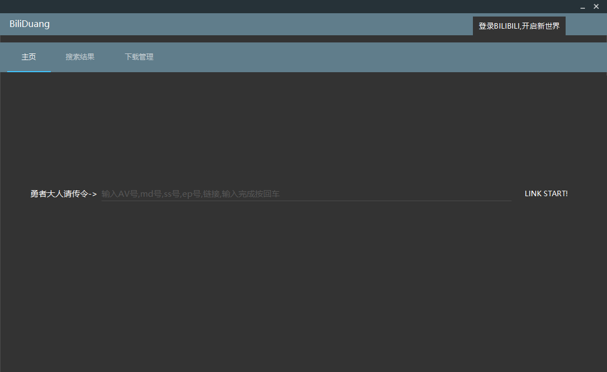
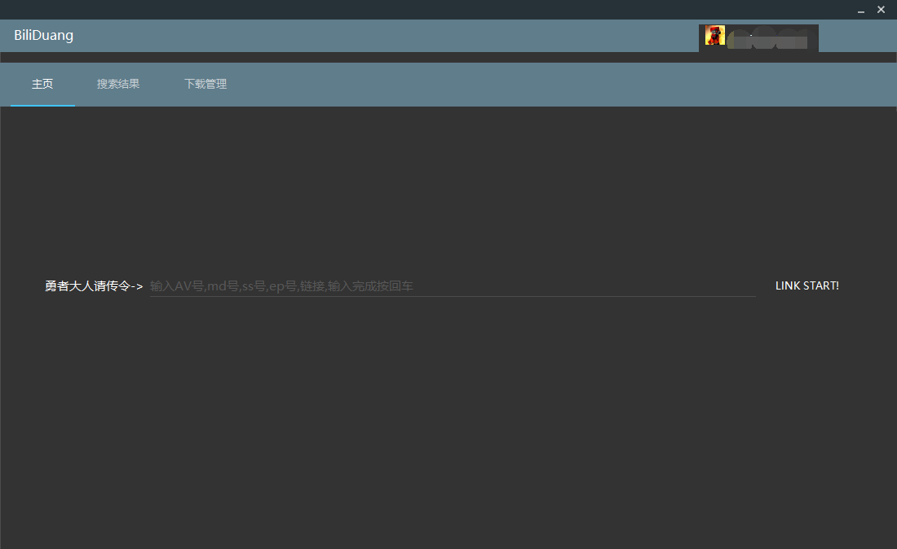
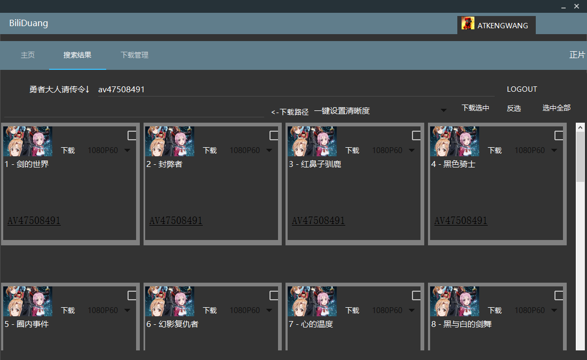
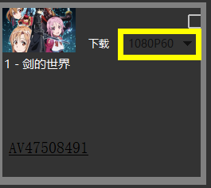
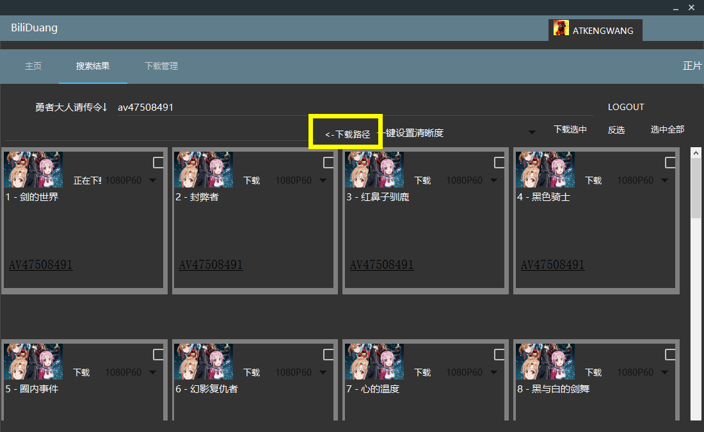
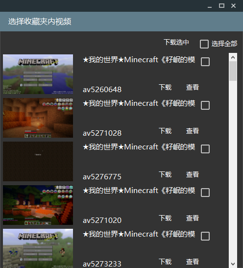
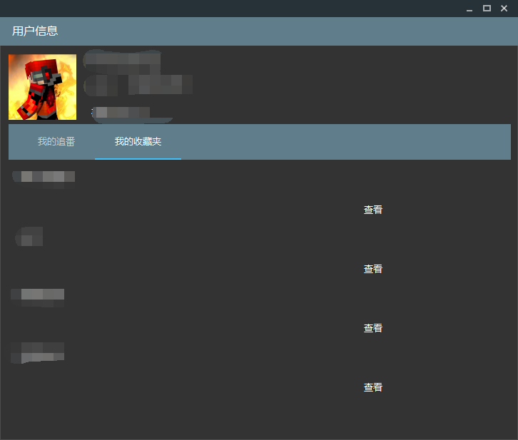

# BiliDuang
 Bilibili 视频下载 C# GUI版

 ## 请注意
 此代码纯为练手,有很多很多BUG,不建议新手直接用!
 Release还不是最新版!

采用Material Design设计 (尽管还是很难看)

特色功能:用户信息获取,用户追番下载,用户收藏夹下载

## 使用方法

> 提示:如果遇见无响应,可以选择 `还原此应用` 来不关闭程序继续操作

### 打开

编译后可直接打开

**.NET Framework需>=4.5.0**

第一次开启速度可能很慢,因为要缓存头像等资源

打开后页面为:

点击右上角的登录即可登录

**注意:登录暂不支持不自动登录,意味着下一次开启软件会自动登录**

点击后可能会弹出脚本错误窗口,比如

我们点击**是**即可

输入账号密码后点击登录按钮登录

稍等片刻您就已经登录了!

如图样式(图片为你的头像)即为登录成功,可以进行接下来的操作

### 下载视频

我写了N种下载方案,针对各种复制过来的网址

目前支持的有

* av号:av170001 , AV170001 , https://bilibili.com/av170001 等格式
* 番剧的av号: av47508491 会自动跳转到 https://www.bilibili.com/bangumi/play/ss4452/
* ep号(哔哩哔哩为每一集番剧设置的号码): ep266609 , https://www.bilibili.com/bangumi/play/ep266609
* ss号(每一季番剧的编号): ss4452 , https://www.bilibili.com/bangumi/play/ss4452/
* md号(番剧介绍页的号码):md24755609 , https://www.bilibili.com/bangumi/media/md24755609
* \***ml号**(收藏夹编号):ml761171511 , https://www.bilibili.com/medialist/detail/ml761171511?type=2
* **BV号**(2020/3/23推出的标准):BV17x411w7KC , https://www.bilibili.com/video/BV17x411w7KC/ (不是我故意用这个视频,是因为这是动态最新的视频)

*:此方法与其他不一样,在后面会写

#### 普通下载

在文本框中输入ID或网址,点击`Link Start!`或者回车

稍等片刻,即可看到结果

##### 单集下载

在想要下载的集中选好清晰度

**清晰度假如选择得太高会自动往下调整**

再点击左边的下载,此时会让你选择下载路径,选择好后即可在`下载管理`看到下载任务

##### 多集下载

选中你要下载的集或者选中全都,点击下载路径按钮来选择下载路径

点击一键设置清晰度标签右边的复选框即可一键更改所有的清晰度

再点击下载选中即可开始下载,在`下载管理`可以看到下载内容

#### 收藏夹下载

输入收藏夹编号,回车或点击按钮,稍等片刻,会弹出一个对话框

你可以在其中选择直接下载或者查看(以普通AV方式查看)

或者可以选择你要下载的点击下载选中,之后的步骤大同小异

> 注意:您需要关闭此对话框才能操作主窗口!

### 下载管理

> 注意:假如添加后未开启下载,请手动点击 开始下载
>
> 目前写的最多1个任务下载,以后再改

## 特色功能

### 用户追番查看+下载

登录账户后点击头像,弹出对话框

即可看到你的追番,支持翻页,一页十个,点击下载即可在主窗口 查看下载

### 用户收藏夹下载

在刚才打开的用户信息对话框中,选择`我的收藏夹`

即可看到你的收藏夹

点击查看即可打开查询窗口下载

### 下载列表保存

在你关闭 BiliDuang 时,如果下载列表中有未完成的任务,将会记录下来并在下一次启动时询问是否继续下载

### 解锁区域限制

感谢 [BiliPlus](https://www.biliplus.com/) 提供的 API 接口.

只需要在设置中勾选 `大陆无版权` 即可使用 BiliPlus API 来解锁区域限制

## 感谢

* 感谢各个网站提供的代码提示与API参考

* 本项目使用了[MaterialSkin](https://github.com/IgnaceMaes/MaterialSkin)的[中国修改版](https://gitee.com/victorzhao/MaterialSkin)
* 本项目使用了[ffmpeg](https://ffmpeg.org/)

## 注意

该软件遵从 [GPL协议](LICENCE)

1. 请不要闭源此项目
2. 请使用同样许可证

## 捐赠

爱发电: [https://afdian.net/@kengwang](https://afdian.net/@kengwang)

bitcoin : 1Q6RSmD7PPAjuMRs2Wo5F8awugTogAyFx

usd : 0xF684271Da71b26c5b1f452BFA17c6599f4c83685

bitcoin cash : qqmuvz3r6auqvucz7l63h5qvl3g2nzkzksaxerhgug

Ether : 0xF684271Da71b26c5b1f452BFA17c6599f4c83685

Stellar : GCZIMQYQB6SMLPMQYWJHMLHPUJHNDIR7VH2CU7GJSNEQPLXJNELIUQ6X

您的打赏是我最大的动力!
